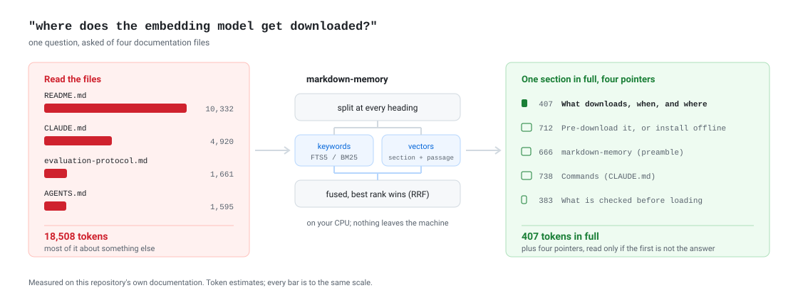

# markdown-memory

**Your coding agent reads whole Markdown files to answer one question. This returns the
section that answers it.**

Ask an agent a question about your docs and it opens the files that might answer it, whole.
Most of what lands in its context is about something else, and the part you wanted competes
with it. markdown-memory indexes your documentation by heading, so the same question comes
back as a few sections, each addressable by its breadcrumb and quoted verbatim.

<picture>
  <source media="(prefers-color-scheme: dark)" srcset="docs/assets/how-it-works-dark.svg">
  
</picture>

Measured on this repository's own documentation - `README.md`, `CLAUDE.md`, `AGENTS.md` and
`docs/evaluation-protocol.md`, 11,086 tokens in all:

```
search_docs("where does the embedding model get downloaded")

  128 tok  README.md  markdown-memory > The embedding model > Pre-download it, or install offline
  181 tok  README.md  markdown-memory > The embedding model > What downloads, when, and where
  577 tok  README.md  markdown-memory
  494 tok  CLAUDE.md  markdown-memory > Commands
  283 tok  README.md  markdown-memory > The embedding model > When it goes wrong
```

**1,663 tokens instead of 11,086**, and the section that actually answers is 181 - a
sixtieth of what reading the files costs. Every hit carries its full text, so a good
answer usually needs no follow-up call at all.

It is a local [Model Context Protocol](https://modelcontextprotocol.io) server - MCP is the
protocol agents use to call tools - and it runs entirely on your machine: parsing with
`markdown-it-py`, embeddings with
[EmbeddingGemma-300m](https://huggingface.co/onnx-community/embeddinggemma-300m-ONNX)
(quantized ONNX on CPU, 768 dimensions), storage in SQLite - one database per documentation
root, with a keyword index and two vector indexes over it. No API key, no network after the
first model download, nothing leaves the machine.

## Install

### Prerequisites

- **Python 3.11 or newer.** The project develops on 3.12 and CI runs 3.11 through 3.14.
- **[uv](https://docs.astral.sh/uv/)**, which manages the interpreter and the dependencies:
  ```bash
  curl -LsSf https://astral.sh/uv/install.sh | sh     # macOS / Linux
  ```
- **Roughly 1 GB of disk**: ~330 MB for the embedding model, the rest for the index.
- Linux or macOS. Everything runs on CPU; there is no GPU path and no API key.

### Get it

```bash
git clone https://github.com/hishamkaram/markdown-memory
cd markdown-memory
uv sync
uv run markdown-memory            # serves MCP over stdio; Ctrl-C to stop
```

The server speaks JSON-RPC on stdin/stdout, so running it by hand only proves it starts.
Register it with a client to actually use it.

### Register it with your client

Claude Code / Cursor (`.mcp.json` or `~/.cursor/mcp.json`) - `--project` keeps the
client's working directory, which becomes the default documentation root:

```json
{
  "mcpServers": {
    "markdown-memory": {
      "command": "uv",
      "args": ["run", "--project", "/absolute/path/to/markdown-memory", "markdown-memory"]
    }
  }
}
```

Claude Desktop has no meaningful working directory, so set the root explicitly:

```json
{
  "mcpServers": {
    "markdown-memory": {
      "command": "uv",
      "args": ["run", "--project", "/absolute/path/to/markdown-memory", "markdown-memory"],
      "env": { "MARKDOWN_MEMORY_DOCS_DIR": "/absolute/path/to/your/docs" }
    }
  }
}
```

**A fresh clone needs one edit.** The `.mcp.json` committed here names an absolute path on
the machine it was written on; change it to where you cloned. It cannot be
`${workspaceFolder}` or `${CLAUDE_PROJECT_DIR}` - see below for why - and there is a
`.mcp.json.example` beside it to copy.

Claude Code can write the entry for you instead:

```bash
claude mcp add markdown-memory -- uv run --project "$PWD" markdown-memory
claude mcp list                    # markdown-memory should be listed and connected
```

### Index once, then search

A freshly registered server knows nothing yet. From the client, call it once:

```
index_directory()                  # scans the docs root, embeds what it finds
list_documents()                   # index_status.coverage should read "verified"
```

The first call downloads the embedding model and then indexes, so it is the slow one - see
[The embedding model](#the-embedding-model). After that, indexing is incremental: re-running
it costs milliseconds when nothing changed. If `coverage` reads `"unknown"`, something was
missed and `index_status.message` says what to run.

## The embedding model

### What downloads, when, and where

The server starts a background thread that fetches three files from
[`onnx-community/embeddinggemma-300m-ONNX`](https://huggingface.co/onnx-community/embeddinggemma-300m-ONNX)
at a pinned revision: the quantized ONNX graph, its external weights, and the tokenizer.
About **330 MB**, once per machine, into:

```
$XDG_CACHE_HOME/markdown-memory/models/embeddinggemma-300m-onnx/     # ~/.cache/... by default
```

The cache is shared by every project on purpose - the weights are identical and read-only,
so copying them per project would be pure waste. Point `MARKDOWN_MEMORY_MODEL_CACHE`
somewhere else to move it. The download is skipped entirely when all three files are already
there.

### Pre-download it, or install offline

To fetch the model deliberately rather than on the first query:

```bash
uv run python -c "
from markdown_memory.indexer import DEFAULT_EMBEDDER, create_embedder
from markdown_memory.server import ServerConfig
create_embedder(DEFAULT_EMBEDDER, cache_dir=ServerConfig.from_env().model_cache_dir).warm_up()
"
```

For a machine with no network, copy that cache directory from one that has it. The three
files are all that is needed, and their presence is the whole check.

### Presets

Two presets, chosen with `MARKDOWN_MEMORY_EMBEDDER`:

| Preset | Dimensions | Download | Peak RAM | Indexing | Held-out Top-1 / Top-3 / Top-5 |
| --- | --- | --- | --- | --- | --- |
| `embeddinggemma` (default) | 768 | ~330 MB | ~1.6 GB | 2.4-3.8 vectors/s | 85% / 97% / 97% |
| `bge-small` | 384 | ~65 MB | ~1.1 GB | ~12 vectors/s | 68% / 82% / 88% |

Accuracy is the frozen baseline in `scripts/eval_data/baseline.json`, recorded by
`scripts/eval_retrieval.py` over a 54-section corpus and the 34 **held-out** paraphrase
queries, which were written before any parameter was tuned. The **dev** set - the one
tuning is allowed to look at, and deliberately harder - scores 71% / 88% / 91% with
EmbeddingGemma and 53% / 68% / 79% with bge-small. Exact identifiers - flags, environment
variables, error strings - are 100% Top-1 with either preset, because FTS5 answers them.
Query latency is not in the table on purpose: it swings by 2-3x with what else the machine
is doing, so the baseline records it as informational and so should you.

Switching preset **discards the whole index**: the two produce vectors of different sizes,
which cannot be compared, so every documentation root has to be indexed again.
`index_directory` reports that when it happens.

**The first index of a large documentation set is slow.** Every paragraph, list item, table
row and code block costs one vector; a section costs none of its own, because its vector is
pooled from its passages. A 1,700-section set is therefore on the order of 7,000 vectors at
2.4-3.8 vectors per second. Pooling cut the reference corpus from 148 embeddings to 104 and
a full rebuild from 49.1 s to 27.4 s, which scales that budget to roughly **15-35 minutes**
- an order of magnitude rather than a measurement, since nobody has timed a set that size
since the change. Budget for it, and run it once: indexing is incremental by SHA-256, so a
re-index that finds nothing changed takes milliseconds (8 ms for 36 sections) and only
edited files are re-embedded. `bge-small` indexes several times faster at a real cost in
accuracy.

EmbeddingGemma is distributed under the [Gemma Terms of Use](https://ai.google.dev/gemma/terms);
the revision is pinned. See [License](#license) for what that means for you.

### When it goes wrong

- **The server starts even when the model cannot load.** Warm-up runs on a background
  thread and only logs `Embedding model warm-up failed; it will be retried on first use`.
  The failure surfaces on the first tool call instead, as
  `Cannot load embedding model onnx-community/embeddinggemma-300m-ONNX: ...`. So "the server
  is running" is not evidence the model is there.
- **The first `search_docs` can block for the length of a 330 MB download.** Pre-download it
  (above) if that matters.
- **All logging goes to stderr.** stdout carries JSON-RPC frames only, so a client that
  shows you "the output" may be showing you nothing. Set `MARKDOWN_MEMORY_LOG_LEVEL=DEBUG`
  and read stderr.
- **Switching preset discards the index.** The two models produce vectors of different
  sizes, which cannot be compared, so every root must be indexed again. `index_directory`
  says so when it happens.
- **Searches come back empty or stale.** Run `index_directory` again; it is incremental, so
  it is cheap. If `index_status.coverage` stays `"unknown"`, its `message` names the files
  that could not be read.

## Tools

| Tool | Purpose |
| --- | --- |
| `index_directory(directory=None)` | Scan a tree, (re)index new/changed `.md` files (SHA-256), purge deleted ones |
| `list_documents(directory="")` | `{documents, index_status}`: indexed paths, titles and section counts, and whether a full index run vouches for them |
| `get_document_outline(file_path)` | Hierarchical TOC with line ranges and token estimates |
| `read_section(file_path, heading_path, include_subsections=False)` | Verbatim text of one section |
| `search_docs(query, limit=5)` | `{results, index_status}`: BM25 + passage-level vector search fused with Reciprocal Rank Fusion (k = 60); each hit reports the `matched_passage`, and `index_status` says whether the tree searched is known to be whole |

Sections are addressed by breadcrumb: `Root > Child > Subchild`. Oversized sections
(> ~800 tokens) are stored as `Root > Child (Part 1)`, `(Part 2)`, ...; reading the base
path reassembles them byte-for-byte. `file_path` may be absolute, relative to the docs
root, or any unique path suffix. `heading_path` is matched exactly first, then ignoring
spacing around `>`, then ignoring case, then as a trailing fragment (`Child > Subchild`
or just the title); an ambiguous request lists the exact candidates.

## Configuration

| Environment variable | CLI flag | Default |
| --- | --- | --- |
| `MARKDOWN_MEMORY_DOCS_DIR` | `--docs-dir` | `$CLAUDE_PROJECT_DIR` if the client exports it, else the working directory |
| `MARKDOWN_MEMORY_DB` | `--db` | `$XDG_DATA_HOME/markdown-memory/projects/<root>-<digest>/index.db` — one index per docs root |
| `MARKDOWN_MEMORY_MODEL_CACHE` | - | `$XDG_CACHE_HOME/markdown-memory/models` (`~/.cache/...`) |
| `MARKDOWN_MEMORY_EXCLUDE` | `--exclude` (repeatable) | nothing excluded |
| `MARKDOWN_MEMORY_LOG_LEVEL` | `--log-level` | `INFO` |
| `MARKDOWN_MEMORY_EMBEDDER` | `--embedder` | `embeddinggemma` (or `bge-small`) |
| `MARKDOWN_MEMORY_THREADS` | - | unset: onnxruntime picks. A positive integer caps the threads one embedding pass may use |

`MARKDOWN_MEMORY_EXCLUDE` takes glob patterns separated by commas (only commas - a colon
would split a pattern that contains one). A pattern with no `/` matches that name at any
depth, the way `.gitignore` treats one: `eval_data` excludes `scripts/eval_data/corpus/`.
A pattern containing `/` is anchored at the documentation root (`tests/fixtures`,
`docs/generated/*`). Matching is case-sensitive everywhere, and a matching directory is
pruned, so its subtree costs nothing to skip. Files already indexed before an exclusion
was added are purged on the next index.

Without it, a repository that keeps fixtures, vendored documentation or a test corpus
in-tree indexes them as if they were its own docs.

Documents are stored under their absolute path, so one database *can* hold several
projects - but **search only ever answers from the root this server was started with**,
and `list_documents` shows only that root. Each project gets its own database by default,
so this matters only if you point two of them at one file with `MARKDOWN_MEMORY_DB`: the
second is then indexed, invisible, and paying for itself in disk.

### One index per project

Drop a `.mcp.json` like this into any repository whose documentation you want searchable.
Each project owns its index without being told to: the database is keyed on the
documentation root it serves, so a project gets its own exclusions and no chance of
another project's sections - or another project's documents, which stay resolvable by
path across any database they share - appearing in its results.

```json
{
  "mcpServers": {
    "markdown-memory": {
      "command": "uv",
      "args": ["run", "--project", "/absolute/path/to/markdown-memory", "markdown-memory"],
      "env": {
        "MARKDOWN_MEMORY_EXCLUDE": "vendor,third_party,tests/fixtures"
      }
    }
  }
}
```

Any path you do add is written relative, on purpose. Claude Code expands only real
environment variables in `.mcp.json`: `${workspaceFolder}` is a VS Code idea, and even
`${CLAUDE_PROJECT_DIR}` is not set at expansion time - measured on Claude Code 2.1.278,
both produce a *"Missing environment variables"* warning and are passed through as literal
text, which would make the server index a directory named `${workspaceFolder}` and report
success over zero files. The server refuses such a value outright, and resolves a relative
path against `CLAUDE_PROJECT_DIR` (which Claude Code *does* export to the spawned server),
falling back to the working directory only when that is not set. The docs root defaults to
that same project root, so it needs no entry. Each worktree of a repository is its own
directory, so each gets its own index.

By default nothing is written into the repository. (A *relative* `MARKDOWN_MEMORY_DB`
is resolved against the project root and does land inside it - `.gitignore` covers
`.markdown-memory/` for that reason, and any other relative path you choose is yours to
ignore.)
The index lives under `$XDG_DATA_HOME/markdown-memory/projects/`, in a directory named for
the documentation root and a digest of its resolved path - out of reach of `git clean
-xdf`, writable when the checkout is not, and on local disk when the checkout is on a
network share, where SQLite's write-ahead log cannot take the locks it needs. Set
`MARKDOWN_MEMORY_DB` to override it; a relative value is resolved against the project
root. The index is a cache of the Markdown files and is rebuilt from them, so deleting it
costs only the time to index again.

## How search ranks

1. **Keywords (FTS5, BM25).** Stopwords are dropped, identifiers are kept verbatim. A hit
   only counts if it covers at least half of the query's IDF mass or matches an
   identifier-like term - a stray match on "data" or "deploy" no longer outvotes the
   vector index.
2. **Vectors.** Every paragraph, list item, table row (rendered as `Header: cell; ...`) and
   code block - also inside block quotes and list items - is embedded separately. The
   section's own vector is the mean of those passage vectors, not a separate embedding of
   the whole section: the model truncates at 512 tokens, which a long section exceeds. It
   is an aggregate of the passages rather than independent evidence about the section, and
   it finds no section that the passages do not. A passage longer than 600 characters is split into
   consecutive windows at line, sentence or word boundaries, so a long command list or
   configuration block keeps a vector for all of itself rather than for its first 600
   characters. A table split across `(Part n)` sections keeps its header for every part. A
   section is ranked by its closest vector, so one relevant table row is enough.
   Heading-only sections have no vectors and are never returned ahead of their children.
3. **Reciprocal Rank Fusion** of the two rankings.

Cross-encoder rerankers (MiniLM, bge-reranker-base, jina, ColBERT) were benchmarked and
rejected: every one lowered accuracy on technical documentation and cost 2-12 s a query.

All logging goes to **stderr**. stdout carries JSON-RPC frames only.

## How malformed Markdown is handled

- **Skipped heading levels** (`#` then `####`): a heading stack pops every level `>= L`
  before pushing, so breadcrumbs stay well formed.
- **Preamble**: badges/summary before the first heading become `[Overview / Preamble]`.
- **YAML front matter**: kept out of the AST (CommonMark would read it as a setext
  heading) and used as a title fallback. A leading `---` rule followed by prose is not
  mistaken for it. One case is inherently ambiguous - a single `key: value` line between
  two `---` lines - and is read as front matter, as static-site generators do, unless the
  key is an admonition word (`Note:`, `Warning:`, `TODO:` ...).
- **Unclosed code fences**: CommonMark runs them to EOF - or to the closing marker of a
  *later* fence - swallowing the sections in between. The fence is closed before the next
  blank-line-preceded ATX heading instead. A level-1 `# ...` line is treated as a comment
  unless the fence language cannot have `#` comments (JSON, Go, ...). This is a heuristic:
  a fence that merely *looks* closed is only cut on strong evidence (it contains another
  opening fence with an info string, or the document ends inside a bare fence and the cut
  makes the rest well formed), and never when the repair would lose a heading that was
  already found. Repair work is capped per document, so a pathological file costs a
  bounded number of extra parses rather than one per fence.
- **No headings / walls of text**: split on paragraph boundaries, then on lines, then on
  whitespace. A fenced block is only cut when it exceeds the limit by itself.
- **Colliding breadcrumbs** get a ` [2]`, ` [3]` suffix (also against generated
  `(Part n)` paths), so every stored path addresses exactly one section.
- **Headings like `Option<T>`** keep their type parameter; only lower-case formatting
  tags (`<b>`, `<sub>`, `<a>`, ...) are stripped from titles.

## Indexing rules

- `.md` / `.markdown`, regular files only, at most 10 MB; symlinked directories are not
  followed. `.git`, `node_modules`, virtualenvs and tool caches are pruned - index such a
  tree by passing a directory *inside* it, and it is then left alone when an ancestor is
  re-indexed.
- A document is purged only when the walk could have found it and did not. Files under a
  directory that cannot be listed are kept and the directory is reported as an error.

## Development

```bash
uv run ruff check . && uv run ruff format --check .
uv run mypy --strict src/
uv run pytest -v                      # unit + integration (real ONNX model for semantic tests)
uv run python scripts/live_test.py    # spawns the server, drives it over stdio JSON-RPC
uv run python scripts/eval_retrieval.py --show-misses   # retrieval accuracy; fails on regression
uv run python scripts/eval_retrieval.py --rebuild       # ... after discarding the cached index
uv run python scripts/reindex_docs.py DIR --force       # forced re-index + integrity verification
scripts/check.sh                                        # the whole pre-commit gate, fail-fast
```

### For AI coding agents

`CLAUDE.md` is the developer guide (commands, layout, architecture rules, the retrieval
regression policy). `AGENTS.md` and `.cursorrules` carry the short form for Codex and
Cursor. All three share one block of rules for *using* the MCP tools - search first, then
outline, then read a single section; never dump whole Markdown files - and a test keeps the
three copies identical and in step with the code. Project skills for Claude Code live in
`.claude/skills/`: `run-eval`, `reindex-docs`, `test-regression`.

Built on the MCP Python SDK 2.x, where `FastMCP` was renamed `MCPServer`.

## License

MIT - see [`LICENSE`](LICENSE). Two things in this repository are *not* covered by it,
because they are not ours to license:

- **The embedding models.** EmbeddingGemma-300m, the default, is distributed under the
  [Gemma Terms of Use](https://ai.google.dev/gemma/terms), which are not an OSI-approved
  open-source licence; the revision is pinned. The `bge-small` preset is two licences at
  once: the `BAAI/bge-small-en-v1.5` weights are MIT, and `fastembed`, which loads them,
  is Apache-2.0. Nothing is bundled - both are downloaded on first use - but if the Gemma
  terms do not suit you, `MARKDOWN_MEMORY_EMBEDDER=bge-small` avoids them entirely.
- **The evaluation corpus.** `scripts/eval_data/corpus_v2/` is third-party documentation
  vendored verbatim from five projects, pinned by commit, and used only to measure
  retrieval accuracy. Each upstream keeps its own licence, and its licence and NOTICE
  files travel with it in `scripts/eval_data/corpus_v2_licenses/`. The table in
  [`scripts/eval_data/corpus_v2_LICENSES.md`](scripts/eval_data/corpus_v2_LICENSES.md)
  says what came from where; both it and the manifest beside it are generated by
  `scripts/fetch_eval_corpus.py`, so edit the script rather than the files.
